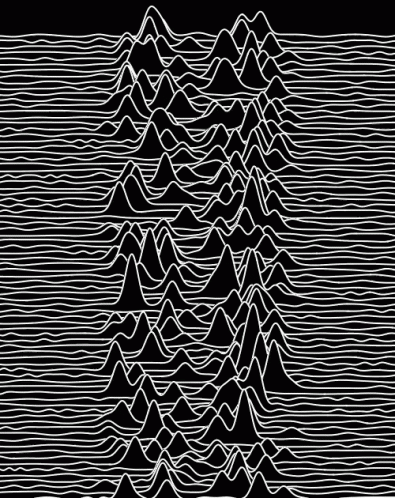

### Hello, world! 👋

I'm Rafael. I am a newcomer to the programming world and taking my first steps in the field. 
Passionate about movies and already a convert to the zen of Python.

-

 
  
  
  
  

  
  ##
 

 
  
   

## My github stats

 

  

